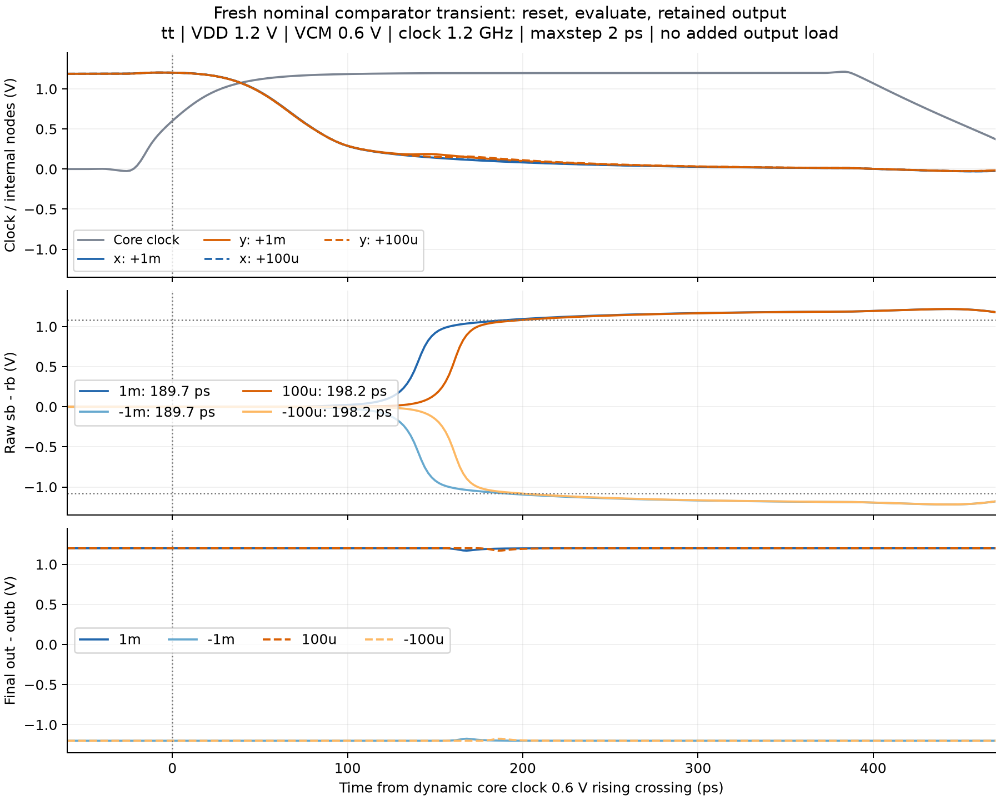

# 关键 testbench：作用、结果分析与设计判断

TB 的核心作用是建立可控因果关系：给一个已知激励，在指定时刻观察一个电路响应，再判断哪一项设计假设成立。课程中每个关键 TB 都按“问题—预测—实验—证据—设计判断”展开；仿真正常结束、测量表达式算出数值、电路达到目标，是三个分别验收的事项。

本导读依据 2026-10-04 的只读 schematic 和保存的 ADE XML 配置。它们不是当前 Maestro 会话参数或新网表；本次补课没有新运行。配置和 DUT 身份见 [TB 证据](../../../notes/evidence/2026-10-04-testbench-guide.json)。以下仅比较器两个案例引用 10 月 3–4 日的新运行，其余结果待验证。现有源 TB 的视图为 `schematic`，保存分析来自同 cell 的 `maestro`。

## 先建立测试的层次

| 层次 | 主要问题 | 典型产出 | 不能直接推出的结论 |
| --- | --- | --- | --- |
| 模块机制 | 采样是否建立、比较器是否复位、CP 电流方向是否正确？ | 分相波形、节点电荷、判决方向 | 系统 ENOB 或 PLL jitter |
| 模块性能 | 建立时间、offset、noise、位权、Kvco 是多少？ | 定义明确的曲线与参数 | 连接到实际负载后仍满足预算 |
| 系统时序 | 每位残差何时有效、输出码何时稳定、反馈是否及时？ | 有效窗口与路径预算 | 噪声与统计良率 |
| 系统性能 | 动态指标、锁定、噪声、杂散是否满足要求？ | 同条件指标、模型边界与归因对照 | 未覆盖的 PVT、失配与寄生性能 |

模块 TB 通常固定共模、源阻抗、负载和时钟，再改变一个变量。系统 TB 保留实际连接，用来检查模块之间的耦合。二者都需要；系统指标下降之后，回到模块 TB 做受控干预才能定位原因。

## SAR ADC：已有 TB 与待建实验

| TB / 模块 | 直接回答的问题 | 重点读什么 | 当前状态 |
| --- | --- | --- | --- |
| `saradc/10Bit_capdac_TB_new` | 已知数字码经这个 CDAC 重构为什么电压？ | code、sample、outp/outn、进位与建立 | 保存配置已读，未新运行 |
| 采样/自举独立 TB | 在指定采样窗内保存输入有多准，器件端间电压怎样变化？ | held voltage、pedestal、Ron、Vgs/Vgd/Vgb | 独立 TB 待建 |
| `saradc/comparator_offset_TB_new` | 输入从正负方向扫过零时，决定在哪里翻转？ | 输入、clock、正反向翻转阈值 | 独立 ADE 副本已新运行 |
| `saradc/course_cmp_delay_20261004` | 动态核能否复位、在 evaluate 内正确判决？ | 内部 clock、sb/rb、最终保持输出 | 四个 nominal 输入已新运行 |
| `saradc/comparator_noise_TB_new` | 指定周期工作点/观察相位下的小信号噪声是多少？ | PSS 轨迹、sample phase、noise density、局部增益 | 原 PSS/PNoise 未新运行 |
| `saradc/comparator_tran_noise_TB` | 重复判决的概率曲线怎样变化？ | 每次有效决定、概率、offset 与曲线宽度 | 保存配置已读，噪声启用待新网表确认 |
| `saradc/clockPhaseGenerator_TB_new` | 各相位的顺序、间隔和边沿质量是否合适？ | phi1/phi1d/phi2/phi2d、dead time、jitter | 保存 PSS/PNoise 已读，未新运行 |
| `saradc/10Bit_ADC_TB_new` / `10Bit_ADC_TB_noise` | 完整转换与动态性能是否成立，噪声带来多少变化？ | sample/比较/码有效时序，再读 FFT | 未新运行系统验证 |

### 1. CDAC TB：先读电荷和位权，再读频谱

实际路径是 `I13 → saradc/adc_10bit` 理想/行为码发生器，再由 `data<0:9>` 驱动 `I6 → saradcII/10BIT_CAPDAC_ld1`。CDAC 两个模拟输入在这个 TB 中接到 `vcm`，输出为 `outp/outn`，保存表达式采用 `outn−outp`。因此这里主要观察理想码驱动的 DAC 重构。它没有包含真实 SAR 比较器判错及逐位搜索的全部误差。

预测问题：桥接电容变大时，低位段对顶板的有效权重如何变化？必须先从实际 split 两节点电荷守恒推导，不能只套二进制电容比例。该独立 DUT 与 ADC core 内直接集成的阵列、mux 版本也有差异，单独结果不能直接代入系统。

建议先在独立副本建立三个短 transient：单 bit 切换、关键进位、同一 code 在不同 sample 时刻读取。测 `w_i = Vdiff(code=2^i)−Vdiff(code=0)`，保留符号；对每次切换同时记录最终步幅和到规定误差带的建立时间。单 bit 电压权重来自电荷分配，不能仅凭元件名确认。

然后用覆盖所需码域的静态扫码计算 `DNL[k]=(V[k+1]−V[k])/LSB_ref−1`；`INL[k]=(V[k]−Vfit[k])/LSB_ref`。记录输出方向、端点/最佳拟合基准和是否去除 gain/offset。这里得到 DAC 电平的线性，不等同于完整 ADC 的 transition-level DNL/INL。明显负步幅说明非单调；大进位处的突变常提示段间权重问题，但需要单 bit 结果与桥接扰动对照才能归因。

| 观察 | 候选机制 | 下一项受控对照 |
| --- | --- | --- |
| 延后读数，误差明显减小 | 开关/reference/顶板未建立 | 保持 code 与负载，扩大建立窗 |
| 最终电平仍在特定进位处偏离 | 有效位权、bridge、寄生或码顺序 | 单 bit 权重与 bridge 微扰 |
| 所有码主要是比例偏差 | 总增益/reference/解码尺度 | 校对 reference 和端点拟合 |
| 重构波形周期或方向异常 | code 顺序、sample 控制、位序 | 对齐理想码与每次顶板响应 |

原保存状态是 transient、`fclk=1.2 GHz`、`tone=127`、`numPoints=512`，频谱表达式用 `numPoints/2` 点和 Rectangular 窗。需要从码发生与 sample 事件确定真正的更新率、基波 bin 和稳态区间，再解释 ENOB/SINAD/SFDR。上述静态位权/DNL 实验是待执行改造，原 TB 名称或保存 FFT 表达式不证明它们已测完。

### 2. 采样与自举 TB：区分建立、保持跳变和非线性

`saradcII/boosted_SH_switch` 已存在，主要信号器件包括 `M4 → gpdk045/pmos2v`；已读 ADC 采样路径没有确认实例化这个自举 cell，多处是 `bmslib/sw_no` 行为开关。自举教学需要独立晶体管 TB。结构机制见 [S03](S03-sampling-bootstrap.md)。

预测问题：同一采样窗和 Cload，输入接近摆幅端点时，held error 会怎样变化？待建 TB 用已知电压源、可调源阻抗、开关、代表性 Cload 和实际时钟驱动，先 DC 电平再 sine；保持窗中测 `Vheld−Vin(t_aperture)`。时变输入的基准是定义好的 aperture 时刻，而非保持末端的实时输入。

| 实验 | 结果分析 | 能形成的设计判断 |
| --- | --- | --- |
| 扫输入 DC 与采样窗长 | acquisition error 随窗长衰减；近似 RC 只用于合适区间 | 所需采样窗、信号相关 Ron、驱动能力 |
| 看关断前后瞬时变化 | 分开 acquisition 与关断 pedestal；分辨 clock feedthrough/charge injection | 关断顺序和差分抵消是否值得调整 |
| 扫保持时间 | 观察 droop；用泄漏/电容关系解释 | 保持误差及长周期适用范围 |
| 固定幅度扫输入频率 | held samples 的 THD/SNDR；校对 aperture 与相干采样 | 带宽和信号相关非线性 |
| 分相保存端间电压 | 在预充电、采样、恢复各阶段检查极值 | 根据 PDK 额定值审查器件应力 |

延长采样窗只改善建立，不一定改善 pedestal；增加 Cload 可能减小注入电压却降低建立速度。自举目的在于改善信号相关导通特性，其代价需要从额外电容、驱动、电荷耦合和端间电压共同判断。这个工程是 PMOS 实现，必须按真实连接解释，不能沿用 NMOS 的极性说明。理想开关系统仿真无法证明这些晶体管性能。

### 3. Offset ramp TB：阈值与扫描误差分别读

原 `saradc/comparator_offset_TB_new` 的 DUT 是 `I0 → saradc/comparator`，通过 `offsetrampgenerator` 改变输入。2026-10-03 在 `saradc/course_cmp_offset_20261003/maestro` 独立副本重新运行：tt、27°C、VDD=1.2 V、fclk=1 MHz、输入 ramp ±20 mV、每步 100 µV。配置身份和仿真状态见 [运行记录](../../../notes/2026-10-03-comparator-nominal.md)。

先在波形上定位输入、clock 与有效输出的关系，再取正反扫的阈值。新运行保存表达式给出 `Offsetf=−50 µV`、`Offsetr=+50 µV`，两者平均近零。这说明本 nominal 配置下正反向阈值围绕零；**100 µV 的 ramp 网格与 crossing 时刻限制了结论，不能宣称器件失调为零或具有 µV 级精度。**

预测问题：减小 ramp 步幅以后，两个阈值之间的距离是否缩小？若明显缩小，扫描离散化可能主导；若扩大 reset 后缩小，memory effect 是候选机制；若双向中心持续偏移，再检查连接不对称和失配。下一项实验只改变其中一个因素。mismatch offset 分布需要独立失配样本，单一 tt 扫描无法给出 sigma 或良率。

注意该 DUT 是 `saradc/comparator`；下述高速 TB 是 `saradcII/comparator`，即使名称相同，也必须核对两者的网表，不能直接合并成同一器件的性能报告。

### 4. 判决延迟 TB：完整的实测分析案例

新副本 `saradc/course_cmp_delay_20261004` 从 `comparator_noise_TB_new` 复制 schematic，DUT `I9 → saradcII/comparator`。改用短 transient，未执行源 TB 的 PSS/PNoise。条件是 tt、27°C、VDD=1.2 V、VCM=0.6 V、fclk=1.2 GHz、源边沿 10 ps、stop 10 ns、maxstep 2 ps、moderate、无随机噪声/新增输出负载。

预测问题：输入差分缩小十倍，再生是否变慢十倍？本轮采用助教“更慢、方向不变”的假设，学员独立判断尚待反馈。

测量起点是内部 clock `/I9/I0/net11` 上升跨越 0.6 V；终点是预期符号的 `sb−rb` 达到 1.08 V，并保持到内部 clock 下降跨越 0.6 V。舍弃前三次 evaluate，再测五次。

| 输入差分 | 动态核延迟，约 | 最终符号 | 实测解释 |
| --- | --- | --- | --- |
| +1 mV / −1 mV | 190 ps | 正 / 负 | 两方向 nominal 判决正确 |
| +100 µV / −100 µV | 198 ps | 正 / 负 | 小输入慢约 8.5 ps，仍在本地 evaluate 内完成 |

按四步读图：先看 x/y 和 sb/rb 在 reset 尾端的预充电；再看内部 clock 开启 evaluate；随后看 sb−rb 拉开并达到阈值；最后看外层输出是否映射到正确符号。实测内部高相位约 446 ps，顶层 clock 到内部边沿约 63 ps，原始 reset 差分最大约 0.14 µV。

设计判断有三层：

1. 输入缩小十倍只使这里的总延迟增加约 8.5 ps。`t ≈ t_initial + τ_reg ln(Vtarget/|Δv0|)` 有助于解释趋势；两个幅度和包含大信号建立的总延迟不足以确认或拟合再生时间常数。
2. `446−198≈248 ps` 是按当前阈值定义得到的本地 evaluate 剩余时间。系统还包含 CDAC settling、控制/clock 路径、buffer/SR latch 更新、接收端 setup 等；这个数不能称为 SAR 每位系统裕量。
3. 动态核复位时，外层 NAND SR latch 保持旧决定。所以固定输入下最终 out 可以一直不变。用它的连续 crossing 测判决时间会漏掉事件；下一实验应让正负输入交替，确保最终输出真的更新。

四点 retained run 均为 Spectre 0 errors、2 warnings；重复 CMI-2426 的影响尚未评估。五个确定性周期验证重复性，不是五个噪声统计样本。2 ps 步长、moderate 精度与 crossing 插值也不支持将打印的小数位当作亚 ps 精度。完整测量口径见 [S04 实验续篇](S04a-reset-evaluate-evidence.md) 和 [新运行记录](../../../notes/2026-10-04-comparator-delay.md)。带 CDAC 负载、有限输入源阻抗、kickback、噪声、失配和系统时序均待验证。

### 5. 比较器噪声 TB：局部线性噪声与决定概率互相核对

`comparator_noise_TB_new` 保存输入 `vin=500 µV`、PSS 周期 `2*period`、tstab `2*period`、10 harmonics；PNoise 为 sampled，频率 1 Hz 至 fclk/2。先确认周期工作点真正收敛，clock 周期、采样相位和观察量定义合理，再讨论噪声。

保存表达式对 `getData("/out" ?result "pnoise_sample_pm0")` 平方、积分、开方得到 TotalNoiseOutput，再除 `gain=100` 得 InputReferredNoise。**这个 gain 是保存变量，尚未证明它是该观察相位的实际局部小信号增益。**输入参考一般应由 `σ_in=σ_obs/|∂Vobs(t_s)/∂Vin|` 推出；硬限幅后的全摆幅不能直接作为线性增益。还需核对数据是 ASD 还是 PSD、积分频率界限/边带、结果 family 与 `value` 的横轴语义，不能只看表达式名称。

`comparator_tran_noise_TB` 用另一种方法：扫 `vin=−1m:125u:1m`，重复决定。其观测路径已只读核实为：DUT `I8` 的 `net8/net011` → `E0` VCVS（增益 `1/(2*VDD)`）→ `I9 → ahdlLib/comparator` → 0/1 observer `/out`。因此 `/out` 是额外判决观察器，不能当成 DUT 的模拟输出。

原保存输出 `average(clip(v("/out") 10 ns 10 µs))` 是观察器的时间平均。即使输出为 0/1，时间平均也只在有效窗口/保持时间和观察器行为符合条件时等于每次决定的概率。更稳妥的实验是在每次 evaluate 后同一有效相位抽一个决定，统计 `P(+)=N_+/N_valid`，单列未完成判决数。

若指定条件下输入参考随机噪声近似高斯，可用 `P(+|Vin)=Φ((Vin−V50)/σ_in)` 描述曲线。50% 点反映该条件的有效偏移；约 15.87% 至 84.13% 的输入间距为 `2σ_in`。符号按实际连接校正；样本相关、观察器斜率和判决超时都会改变解释。每个器件的随机噪声曲线与不同失配样本的 V50 分布分别统计。

该 TB 保存 noisefmax=50 GHz、seed=1，但 `noiseonoff` 字段为空；模型 section `mc` 和 `noiseruns=100` 都不能证明噪声或 Monte Carlo 已启用。先用新网表确认，并作 noise-off/on 对照，再跑种子/样本。输入参考噪声和 PSS/PNoise 的一致性也需要相同工作条件与对应观察时刻；当前没有新噪声测量。

### 6. 时钟相位 TB：先检查分相，再测 jitter

`clockPhaseGenerator_TB_new:I0 → saradc/clockPhaseGenerator`，phi1/phi1d/phi2/phi2d 对应 net7/net6/net5/net4。先用 transient 明确实际有效极性、延迟、overlap/dead time 与 duty，再根据下游开关动作判断。名称中的 d 不能代替实测边沿关系。

预测问题：增加相位输出负载以后，哪些先后关系最容易改变？在接收端门限处测各边沿，保持输入边沿和 VDD，只改变负载。相位重叠可能形成不希望的导通路径；dead time 过长会压缩 acquisition 或 evaluate。零负载下的漂亮相位不能证明实际负载时序。

保存状态有 PSS/PNoise，输出名是 `jitter[ps,rms]`，表达式却请求 `drplJitter(... ?unit "Second" ...)`，没有显式乘 `1e12`。需要核对工具数据单位与显示缩放后才能报告 ps。jitter 还需要注明输出节点、边沿、门限、积分频带与模型，不同观测端不能混用。这一 TB 的 jitter 未新运行。

### 7. 顶层 ADC TB：先验证码有效，再解释 ENOB

`10Bit_ADC_TB_new:I0 → saradcII/10bit_adc_core_w_split_dac_ld1_msb`。保存 fsample=100 MHz、fclk=(10+2)fsample=1.2 GHz、numPoints=1024、tone=503，因此推导 `fin=49.12109375 MHz`。这些是保存值和公式推导，当前源实际幅度、采样事件与 FFT 窗口仍需新网表/波形校对。

第一项系统实验用 DC/低频输入，保存 sample、每位控制、残差、比较器原始与最终输出、结果有效/锁存及 bus。逐位检查“切换→残差建立→evaluate→决定→接收”，确定稳定码的采样相位。源码推导的两段 sample 和十次比较也在此检验。已读 `analog_mux_8` 未见 vin↔cap 采样实例，先审计当前系统新网表与实际采样路径，再解释性能。

第二项才做动态指标。core `out<9:0>` 连到顶层 `out<0:9>`，保存 Analog Out 表达式又把顶层 out<9> 当 MSB。先用已知输入/已知码逐位校对 mapping，按门限判 0/1 后还原整数码，确认仅在有效相位取样。以电压直接加权 bus 的表达式可能混入边沿和逻辑电平变化，需要和整数码频谱交叉核对。

保存 FFT 窗口为 40 ns 至 10.28 µs、1024 points、Cosine2 窗；ENOB 与 SINAD/SNR 表达式的频率界限略有不同。先核对工具 API 对这些参数的含义，确认实际采样间隔、点数、启动舍弃、基波与谐波 bin、单边频谱功率及窗口校正，才比较指标。

| 指标/结果 | 主要含义 | 诊断方向与限制 |
| --- | --- | --- |
| SINAD/SNDR | 基波相对 noise+distortion | 有效码、窗口、幅度先审计，再定位电路 |
| SNR | 约定口径排除谐波后的噪声 | 若开启噪声后下降，检查噪声预算；仍需排除确定性误差混入 |
| THD / SFDR | 谐波合计 / 最大杂散 | 谐波与 bit-pattern spur 是线索，不单凭谱线归因 |
| ENOB | 同定义 SINAD 的等效分辨率 | 标准 `(SINAD−1.76)/6.02` 的幅度基准及工具修正需写清 |
| 错码或局部突变 | 搜索/位权/时序可能出错 | 先对齐同次残差和决定；错误采样也能产生错码 |

`10Bit_ADC_TB_noise` 保存 noisefmax=50 GHz、seed=1，noiseonoff 同样为空。需从新网表证实启用，然后用相同输入、窗口、码相位、模型和负载做 noise-off/on 对照。若噪声开启后 SINAD 几乎不变，可能确定性失真主导，也可能噪声没有生效；要同时看噪声配置和波形/谱功率。两类系统 TB 均尚未完成新运行。

## 基础 PLL：模块 TB 与环路结果的分析路线

目前只核实课程入口 `zambezi45/pll` 和 `zambezi45_sim/pll_sim`，实际 PFD/CP/filter/VCO/divider master 与新仿真绑定待查。以下是待执行的基础整数 N 实验，不虚构现有 cell/TB 名称或实测数值。先固定整数 N，明确反馈取自哪个输出端，再做模块特性与环路闭合。

| TB | 激励与观测 | 结果怎样分析 | 下一项设计判断 |
| --- | --- | --- | --- |
| PFD | 两时钟同频扫相差，再加小频差；看 UP/DN、reset | 正负相差对应驱动方向；近零相差观察最短脉冲；频差下看连续校正与 cycle slip | dead zone、reset 延迟、最大工作频率 |
| CP | 用已知 UP/DN 脉冲；扫被钳定的 Vctrl；看 source/sink 电流与每周期净电荷 | `Q=∫I dt` 比峰值更能揭示 mismatch、开关注入和泄漏；同时测支路 | compliance、匹配和 reference spur 候选来源 |
| Loop filter | 电流阶跃/脉冲，AC 阻抗；看 Vctrl | 分辨快速电压跳变与后续充放电，提取实际极零点与阻抗 | ripple、带宽/阻尼、CP/VCO 负载影响 |
| VCO | 扫 Vctrl，带实际 divider/input 负载；看启动、频率、摆幅、功耗 | 局部 `Kvco=df/dV`，说明 Hz/V 或 rad/s/V；校对单调性和调谐范围 | 工作点是否覆盖目标，增益变化怎样影响环路 |
| Divider | 不同输入频率/摆幅/占空比和 reset；逐沿计数 | `fdiv=fvco/N` 只是平均检查，还需找漏沿、额外沿和相位延迟 | 最大频率、输入灵敏度、启动/复位确定性 |
| 闭环 startup/lock | 固定 N、reference 和初态；看 Vctrl、输出频率、相位误差、UP/DN | 频率接近还需相位误差有界、Vctrl 未顶到 rail、连续保持符合判据 | 环路方向、捕获范围、锁定时间与重调谐 |
| 小扰动闭环动态 | 锁定后加小 phase/frequency step；看误差和 Vctrl 衰减 | 对照线性模型的阻尼/自然频率；大幅 cycle slip 不用于线性拟合 | filter/Kvco/N 对稳定性和速度的取舍 |
| 闭环 noise/spur | 指定输出端和稳态，分别启用噪声源；同步看 reference ripple | 区分确定性 reference spur 与相位噪声；注明噪声谱和积分频带 | 带宽预算、CP 电荷误差和输出 jitter |

### 三个必须会读的 PLL 结果

**CP 的小脉冲怎样关联 spur。**同一 Vctrl 与负载下分别量 UP/DN 脉冲电荷，再合成每周期净电荷；环路 filter 把周期电流变为 ripple，VCO 将其转为相位/频率调制。reference spur 与 Vctrl ripple 同时存在只构成机制线索。通过改变 CP mismatch 或 pulse timing、保持其他条件，再看 ripple/spur 是否对应变化，才能支持因果判断。详见 [P02](P02-pll-block-circuits.md)。

**锁定波形怎样关联稳定性。**若 Vctrl 触 rail 且频率长期不达目标，先检查调谐范围和环路方向；若频率已接近但相位反复滑移，不能记录为稳定锁定。锁定后的小阶跃衰减可与线性模型比较；启动时的大摆幅、PFD 饱和、cycle slip 需要时域解释。锁定判据写出频率容差、相位误差界和持续时间，数值根据规格设定。详见 [P03](P03-pll-loop-dynamics.md)。

**相位噪声怎样换算 jitter。**若工具输出为 SSB `L(f)`（dBc/Hz），在注明其定义并采用小相位噪声近似时，`σφ²=2∫10^(L(f)/10)df`，`σt=σφ/(2πfout)`。若输出已是相位 PSD，按 PSD 约定积分，不再机械乘二。始终注明输出频率、边沿和积分范围；离散 spur 是否计入总 rms 另列。模型包含的源和闭环分析适用性也要确认，不能以行为 VCO 的零噪声证明晶体管 PLL 的 jitter。详见 [P04](P04-pll-noise.md)。

## 每个 TB 的课程交付

每次实验在 [记录模板](../../../notes/circuit-lab-template.md) 中填写：TB 的单一作用、DUT/激励/观察路径、预测、保存/生效/实测配置、图上事件与数值定义、支持的机制、替代解释、下一项受控干预及系统边界。未运行写“待验证”；已运行也分别记录仿真结束、测量有效和电路验收。

当前下一项实际实验是正负交替的小差分比较器输入，让 SR latch 更新到与上次不同的决定，测最终输出更新时间。它补齐本地判决延迟到外部可采集输出之间的证据。reset 缩短、noise、CDAC、系统和 PLL 各另立实验，不由已有 nominal 四点代替。
