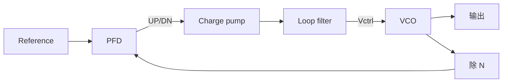

# P01：基础整数 N PLL 为什么会锁定？

问题：参考相位超前时，哪个电路动作应该让反馈相位赶上？先预测：若 VCO 为正 Kvco，UP 应让控制电压增加还是减少？再沿实际环路逐段检查符号。

## 基础结构

PFD 比较 reference 与反馈边沿，CP 把脉宽转为带符号电荷，filter 把电荷转为控制电压，VCO 把电压转为频率，频率积分形成相位，divider 产生下一次反馈边沿。锁定要求平均 `fout=N fref`，相位误差进入规定范围且持续满足；控制电压平坦或 lock 信号为高都不是充分证据。

reference 超前、正 Kvco 情况下，UP 注入电荷提升 Vctrl，使 VCO 暂时更快，从而缩小相位差。若实际电路为负 Kvco、CP 极性反向或 divider edge 有额外反相，必须重新检查总反馈方向。

频率捕获阶段 PFD 可持续给出长脉冲；进入接近锁定后才适合用线性相位模型。整数 N 与输出分频链要分清：规格目标输出端可能在额外 divider 之后，不能直接用 VCO 频率替代。

## 本工程入口与学习安排

教材含 `zambezi45/pll/schematic` 和 `zambezi45_sim/pll_sim`；后者有 `config_plllock_TR`、`config_powerup1` 及对应 AMS 状态。它原本是 fractional-N 工程。本课程先学习整数 N：在工作副本固定反馈整数分频，若模块无法固定则先用明确标注的行为模型建基础环路 TB，再逐个接入实际电路。

本轮尚未通过活跃 PLL 会话读取模块层级，不能给 PFD/CP/VCO 杜撰实际 cell 名称。第一项实验之前补全实际 master、模拟/数字 view、时钟域、供电、reset 与仿真器绑定。

## 最小实验与验收

选择一个整数 N、参考频率和 VCO 可达的初始频率。记录 reference、反馈边沿、UP/DN、CP 电流、Vctrl 与输出频率。先判断环路符号，再看捕获，最后从边沿时间求相位误差。小相位扰动只在已经稳定后施加。

验收：从一次 reference 超前/滞后解释电荷与频率方向；说明频率锁定、相位锁定和有效输出的区别；报告 lock 判据、保持时间和测量端点。先完成单一整数 N 条件，不同时加入 DSM、fractional sequence 和多角落。

下一课：[各模块电路与 TB](P02-pll-block-circuits.md)。
