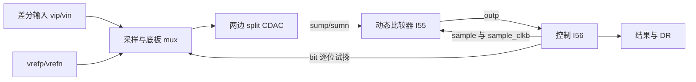

# S01：一次 SAR 转换，电荷和残差怎样运动？

问题：这个差分 10 bit ADC 在哪一刻保存输入，随后为什么不需要输入继续参与每位判决？先预测：输入在采样结束后改变，哪些节点应保持记忆，哪些节点仍应跳变？

## 实际结构与信号路径

`saradc/10Bit_ADC_TB_new/schematic:I0` 的 master 是 `saradcII/10bit_adc_core_w_split_dac_ld1_msb`。该 core 直接包含两边 MIM 电容阵列、桥接电容、reference mux、采样/clamp 路径、`I55 → saradcII/comparator` 和 `I56 → saradc/10Bit_ADC_logic`。

示意图是功能关系；采样控制还驱动 mux/clamp。该 core 同时包含晶体管电路和行为模型，不能称为全晶体管 ADC。

采样时，输入经 mux 加到电容的一侧，求和节点及 split 内节点由 clamp 约束到 `vcm`。采样结束后解除约束，存储在浮置节点的电荷建立输入记忆。转换时底板切到 reference，求和节点发生电荷再分配；比较器只判残差符号，控制器保留或撤销试探位。

单个浮置节点的基本关系是 `Q = Σ Ci(Vx−Vbi)`。无外部注入且电容不变时，`ΔVx = Σ Ci ΔVbi / Σ Ci`；split 阵列要联立两个浮置节点的方程，不能直接套单节点二进制公式。差分编码、正负输入的 reference 交换和 comparator 输出反相都影响最终符号，须沿实际连接追踪。

## 理解理想搜索与真实误差

理想 SAR 用从大到小的位权缩小残差；最后区间宽度是一个 LSB。真实电路中，CDAC 位权偏差改变判决阈值，未建立残差造成时序相关误码，比较器 offset 平移阈值，噪声使判决具有概率性。它们不能仅用一个 ENOB 数字区分。

先定义差分 full scale 的端点与跨度 `VFS`，再使用 `LSB=VFS/2^10`。`VDD`、单端输入幅度和差分 full-scale 跨度是不同量；本工程源参数还需结合偏置及新网表审计。

## 最小实验

在恢复副本中以三个 DC 差分输入替代正弦：接近中码、正向小残差、负向小残差；保持共模相同。先只运行一组 nominal transient，保存 `sample`、内部比较器时钟、两求和节点、逐位控制、`DR` 和输出码。节点名从新网表确认。

选择稳态的一次转换，画出采样结束、十次试探、每次判决及锁存时刻。然后只在保持期间改变外部输入，观察残差是否保留原样；这种干预需记录改变时刻，避免同时改变下一次采样。

验收：能用电荷关系解释至少前三个位的残差变化，能追踪输入到结果的符号，能指出行为模型在哪些结论中屏蔽了非理想因素。若读到异常，先检验 bit 顺序和 polarity，不能把非二进制轨迹立即判为电容失配。

下一课：[split CDAC 的权重](S02-cdac.md)。
