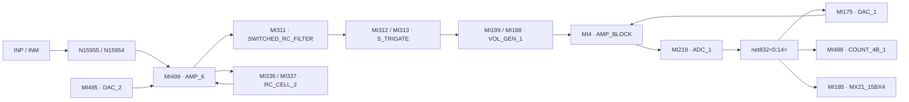

# AFE4404：完整信号链结构学习路线

本路线按用户 2026-10-04 的要求，覆盖接收信号路径上的关键电路，并将 TX、偏置、参考、供电和控制作为必要配套。九个主课保留，新增六篇结构课，把原图、逐支路解释、接口、实验与设计判断连接起来。课文准备完成不代表学员已掌握，也不代表整个反向工程已能仿真。

本轮新读取 16 个 schematic，新增 7 张原生电路图，合计可查看 21 张图。连接和尺寸属于静态 OA 证据；产品规格来自 TI 数据手册；小信号、电荷与噪声关系为带条件推导。本轮没有新网表、工作点或 AFE 仿真。证据见 [本轮连接摘要](../../notes/evidence/2026-10-04-afe4404-signal-chain.json)，来源身份见 [工程地图](../../docs/afe4404-map.md)。

## 先建立实际链路

下图表达已读端口间的连接。连接到开关两端不等于该相位导通，箭头也不承诺每个节点都是单向处理。

重点是 `VOL_GEN_1`、`AMP_BLOCK` 和返回路径 `ADC_1.Z → DAC_1 → AMP_BLOCK`。不能把接收链简化为 TIA→滤波→一个理想 ADC。闭环用途、采样与更新顺序需要相位表证明，暂不命名完整转换架构。

| 接口 | 已确认的 terminal/net | 接口课要回答的问题 |
| --- | --- | --- |
| 输入 | INP/INM → net707/net708 → AMP_6.VP/VM | 开关何时接通，输入共模与 photodiode 电容怎样影响环路？ |
| TIA 输出 | VOP/VOM=net713/net714 → FILTER.VIN1/VIN2 | 摆幅、共模与有限窗建立能否满足后级？ |
| 滤波器输出 | VOUT1/VOUT2=net829/net761 → MI312/MI313 → net721/net720 | 保持电荷在交接中怎样改变？ |
| 接口放大模块 | VOL_GEN_1.VO=net822/net765 → AMP_BLOCK.VI1_1/VI1_2 | 局部反馈、驱动、参考和使能各起什么作用？ |
| ADC 输入 | AMP_BLOCK.VO1_1/VO1_2=net820/net821 → ADC_1.VI1_1/VI1_2 | 输入到电容及再生节点的哪一个相位产生判决？ |
| 反馈 DAC | ADC_1.Z 与 DAC_1.A 共用 net832<0:14>；DAC_1.VO1/VO2=net766/net767 → AMP_BLOCK.VI2_1/VI2_2 | 数字状态如何返回模拟节点，更新方向和权重是什么？ |
| 读出入口 | 同一 ADC 总线接 COUNT_4B_1.D、MX21_15BX4.A | 总线索引、计数/存储、有效事件如何对应最终接口数据？ |

## 课程顺序与完整覆盖

每一行是一个可以验收的小问题。结构课先形成支路图，再到原主课验证性能；一次授课只选择其中一行，不同时验收整张表。

| 顺序 | 课文 | 关键结构与所需产出 |
| --- | --- | --- |
| 1 | [A00](lessons/A00-project-map.md) | 来源身份、输入与反馈闭环；能说清实际连接与控制条件的区别 |
| 2 | [A01a 输入与偏置](lessons/A01a-tia-transistor-structure.md) | 大 PMOS 输入对、输入驱动 NMOS、额外输入支路；一组有条件的差分电流方向 |
| 3 | [A01b 共模与反馈](lessons/A01b-feedback-common-mode.md) | 输出推拉支路、net119 共模感知、内外电容与 Rf/Cf；区分三类反馈 |
| 4 | [A01 TIA 实验](lessons/A01-tia.md) | DC headroom、跨阻、稳定性与采样末端残差；先验收一项单变量比较 |
| 5 | [A02a 电流 DAC 结构](lessons/A02a-current-dac-structure.md) | DAC_CELL_2 的供电支路、选择 MOS、bias 与 compliance；控制态电流表 |
| 6 | [A02 DC 消除](lessons/A02-offset-dac.md) | 输入电流消除、数字 ambient 相减、glitch 和剩余摆幅 |
| 7 | [A03a 保持与后级](lessons/A03a-filter-buffer-structure.md) | 差分存储电容、交接开关、VOL_GEN_1、AMP_BLOCK；完整模拟接口地图 |
| 8 | [A03 分相实验](lessons/A03-switched-rc.md) | 建立、hold droop、charge sharing、reset 与跨相记忆 |
| 9 | [A04a 判决与返回路径](lessons/A04a-adc-feedback-readout.md) | ADC_CELL_1 电容切换与再生、ADC_1 阵列、DAC_1 返回、COUNT/MUX 入口 |
| 10 | [A04 码与转换](lessons/A04-adc.md) | 由事件序列辨认转换机制；位序、符号、零点、单调性与有效时刻 |
| 11 | [A05a TX 与配套](lessons/A05a-tx-support-structure.md) | AMP_5/SWITCH_BLOCK 的端口环路、供电域与接收耦合 |
| 12 | [A05 LED 实验](lessons/A05-led-driver.md) | 电流码、compliance、脉冲电荷与光学信号对应 |
| 13 | [A06 偏置/参考/LDO](lessons/A06-bias-reference-ldo.md) | NIB、参考与电源域逐端追踪；启动、PSRR、噪声注入和负载稳定性 |
| 14 | [A07 时序](lessons/A07-timing-control.md) | CTRL 与 clock/phase/reset/ADC_RDY；一周期事件表和配置生效边界 |
| 15 | [A08 系统预算](lessons/A08-noise-design-review.md) | 输入折算噪声、headroom、建立和转换时间；一项设计修改及最小回归 |

## 怎样判断已经理解一块电路

先用原图回答“输入在哪里、能量从哪里来、信号往哪里去”。随后为关键器件标出 gate 控制、源漏节点、bulk 和供电域；把模拟 bias 与数字 enable 分开。最后分别施加一个差分扰动、一个共模扰动或一个控制边沿，预测哪个节点先变化、哪个节点保存状态。

结构验收需要实际 terminal/net 表、明确的假设和电流/电荷推导。工作区、gm、噪声、offset 和相位裕度需要对应的新运行，不能由 W/L 或 cell 名字直接推出。每块电路最终保存五项记录：问题、预测、实验条件、证据、设计判断，使用 [AFE 记录模板](../../notes/afe4404-lab-template.md)。

系统模型写为 `Iphoto → Ztia → Hphase → Hinterface → conversion → stored code`，各项保留共模、时变开关和饱和约束。只在线性、相位固定且接口已建立的区间，才将其近似为传递函数相乘。输入电流噪声与电压噪声经过的传递函数不同，产品字长也不能直接当作系统误差阈值。

目前已掌握的是助教静态结构证据；学员学习和性能验证均未验收。当前授课从 A01a 的输入支路开始，下一步只检查 `VP−VM` 小幅增加时 `P15738/P15737` 与相连 NMOS 的电流响应。
