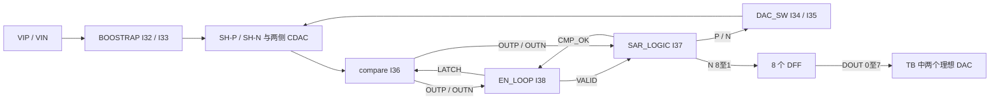

# 第一课：从真实连接理解 8 位异步 SAR 的一次转换

配套 [A05 行为模型→真实电路](A05-model-to-circuit.md)，已有八次判决、七次位权更新的独立教学 Verilog-A 新基线；未替代本工程晶体管仿真。

本课整合服务器 2026-09-29 已有课文。2026-10-04 复查工程文件与先前 bridge 导出；连接是先前只读 OA 证据，数值推导不是新仿真。关键文件的当前哈希与原清单一致，证据见 [项目清单](../../../notes/evidence/2026-10-04-adc-projects.json)。环境通过情况以 [本次记录](../../../notes/2026-10-04-adc-projects.md) 为准。

这节只建立系统级工作模型。已验证内容来自 OA 原理图只读导出和保存的 ADE 状态；工作时序推论尚需瞬态仿真确认。

## 先看两个 cell

- 库 `8_bit_sar_adc`，cell `8bit_SAR_ADC_test`，view `schematic`：激励、输出位序、测量路径。
- 库 `8_bit_sar_adc`，cell `SAR_ADC`，view `schematic`：采样、CDAC、比较器及数字闭环。

建议从本学习目录启动 Virtuoso，以使用这里的 PDK 映射。首次阅读直接打开 schematic。原 config 指向 calibre，后仿留到前仿基线建立以后。

“本学习目录”是服务器 `ADC_LEARNING_ROOT`，机器路径在 `config/local.env`；不要将 Windows 课程目录误当作可直接运行的 EDA 工作区。



图中理想 DAC 在 TB 内，SAR_ADC 核心本身输出数字码。外部 VCLK 同时进入 BOOSTRAP、EN_LOOP、SAR_LOGIC 和 DFF；不能只把它看成采样开关控制。

## 1. 先分清电压与权重

| 项目 | 实际值或连接 | 解释 |
|---|---|---|
| VDD / VSS | 1.8 V / 0 V | CDAC 的 VREF 接 VDD，参考与电源没有隔离 |
| VREF1 | 0.9 V | 接 DAC_SW 的 Vcm，中间参考电平 |
| 输入 Vcm | 变量 0.85 V | 正弦源公共端；不同于 VREF1 |
| 单端输入 | VIP=Vcm+vrange·sin；VIN=Vcm−vrange·sin | 保存的 vrange=0.85 V，单端 0～1.7 V |
| 差分输入 | VIP−VIN=2·vrange·sin | 保存设置为 1.7 V 峰值、3.4 Vpp |
| 采样率 | f=40 MHz | 周期 25 ns |
| 输入频率 | fin=3f/1024 | 117187.5 Hz；1024 个样本覆盖 3 个周期 |
| 单位电容 | CDF c=15.504 fF，4 μm×4 μm | 实际有效电容仍受模型及寄生影响 |

每侧电容权重为：

\[
64+32+16+8+4+2+1+1=128,
\qquad C_{\Sigma}=128C_u=1.984512\ \mathrm{pF}.
\]

正侧 C8～C15 的上极板都连 SH-P；负侧对应连 SH-N。最后那个固定单位电容的开关输入 PIN=NIN=VSS，按开关拓扑其底板保持在 Vcm。可切换的权重是 64、32、16、8、4、2、1，合计七组。

这是第一个架构问题：**七组受控电容为什么能输出八位？** 第一轮比较已经产生一个判决；之后七轮电荷重分配逐步缩小剩余区间。这里应区分比较次数、受控电容组数和输出位数。

## 2. 用电荷守恒推一次切换

假设采样开关已经断开，忽略泄漏、寄生、比较器输入电荷和电压相关电容。单侧顶板总电荷为：

\[
Q=\sum_i C_i(V_T-V_{B,i}),\qquad
\Delta V_T=\frac{\sum_i C_i\Delta V_{B,i}}{C_\Sigma}.
\]

注意：底板升高会使浮置顶板升高，而不是降低。

假设正侧 64Cu 底板从 0.9 V 切到 0 V，负侧同权重底板从 0.9 V 切到 1.8 V，则：

\[
\Delta V_P=-0.45\mathrm V,\quad
\Delta V_N=+0.45\mathrm V,\quad
\Delta(V_P-V_N)=-0.9\mathrm V.
\]

所以理想互补切换下：

\[
\Delta V_{CM,top}=(\Delta V_P+\Delta V_N)/2=0.
\]

**保持的是切换前的顶板共模，不是把顶板强制拉到 0.9 V。** 若采样输入的共模为 0.85 V，理想互补切换保持的是 0.85 V；开关的中间参考 0.9 V 与它不是一个量。

后续七组切换对应的差分步长幅值为 0.9、0.45、0.225、0.1125、0.05625、0.028125、0.0140625 V。结合首次符号判决，理想输入范围跨度约为 3.6 V，8 位理想 LSB 为 14.0625 mV；端点编码、极性与实际不失真摆幅要另行验证。

真实电路中，共模是否恒定还取决于两侧电容失配、寄生、参考建立和开关时序；上述结果是理想基线。

## 3. 读开关，不靠信号名字猜极性

以 DAC_C_SW_1 为例，连接给出以下稳态真值表；暂不讨论翻转瞬间的延迟和竞争。

| PIN | NIN | 底板输出 |
|---|---|---|
| 0 | 0 | Vcm |
| 1 | 0 | VREF |
| 0 | 1 | VSS |
| 1 | 1 | 上下参考通路同时导通，非正常控制组合 |

SAR_ADC 中 I34 与 I35 的 P/N 控制互换，所以两侧可执行互补切换。后续要检查控制过渡是否产生毛刺、参考直通或提前比较。

## 4. 异步环路的读图入口

EN_LOOP 的晶体管连接可化简出稳态逻辑：

\[
VALID=\overline{OUTP\cdot OUTN},\qquad
EN\_LOOP=\overline{VCLK}\cdot\overline{CMP\_OK}.
\]

从 VALID 经三次反相得到 net102≈¬VALID，经 NAND 和后续三次反相，得到延迟后的 LATCH≈EN_LOOP·¬VALID。它是带真实门延迟、受比较器状态驱动的反馈环，不是一个独立固定 900 MHz 的时钟源。

工作假设：采样结束后开启环路，比较器完成判决引起 VALID 变化，SAR 锁存判决并更新 CDAC，比较器复位后进入下一位，最后 CMP_OK 关闭环路。下一课会沿 Q8→Q7→…→Q2 核实 SAR_LOGIC_UNIT 的位推进和每个有效边沿。

时间预算应写成事件约束：

\[
T_s=T_{acq}+T_{conv}+T_{margin},\qquad
T_{conv}=\sum_{k=1}^{8}T_{cycle,k}.
\]

每个 cycle 必须覆盖决策、检测/锁存、DAC 建立、比较器复位与非交叠约束；有些过程可以重叠，不能未经波形确认把全部延迟机械相加。尤其检查小过驱动时的慢判决，以及 CDAC 尚未建立时是否开始下一次比较。

25 ns 是采样周期，不等于全部可用于八次比较。TB vpulse 的周期为 1/f，tr=tf=1 ps，未显式给出脉宽；应在生成的网表与波形中核实默认脉宽和实际有效转换窗口。

## 5. 输出解码的真实位序

已确认连接：

```text
N<8> → DOUT<0> → ideal_DAC.vd7 → 权重 128
N<7> → DOUT<1> → ideal_DAC.vd6 → 权重  64
...
N<1> → DOUT<7> → ideal_DAC.vd0 → 权重   1
```

按现有 TB 重建码字：

\[
code=\sum_{j=0}^{7}2^{7-j}\,bit(DOUT\langle j\rangle).
\]

另一路理想 DAC 接八个反相后的输出，用于产生互补模拟量。理想 DAC 的 transition=100 ps 是测量路径的行为参数，不能把其连续波形的任意 FFT 当成 ADC 的采样码字频谱。应每个有效转换只取一个稳定码字，并核对输出 DFF 的更新边沿和输入样本对应关系。

## 本课讨论题

假设采样完成后 SH-P=1.10 V、SH-N=0.60 V，且所有 CDAC 底板初始为 0.9 V。要缩小 +0.50 V 的差分残差，先执行前述 64Cu 的互补切换：

1. 切换后两个顶板、差分残差和顶板共模分别是多少？
2. 下一组 32Cu 应向哪个方向切换，才能继续缩小残差？
3. 对照 I34/I35 的控制交叉连接，对应 PIN/NIN 应是什么组合？

参考核对：第一次后 SH-P=0.65 V、SH-N=1.05 V，差分为 −0.40 V，共模仍为 0.85 V。下一组应令正侧底板上升、负侧下降，使差分增加 0.45 V，到 +0.05 V。该组正侧 PIN/NIN=1/0，负侧=0/1。这里规定的是期望的模拟切换动作；它与 OUTP/OUTN 及最终码字极性的对应关系，还要沿比较器和 SAR 逻辑验证。

后续最小仿真先使用避开码边界的直流输入、观察数个采样周期，核实八次判决、终止、位序和输出延迟。其后才运行 1024 点相干正弦：有效记录长 25.6 μs，另加启动舍弃时间；原 ADE stop=26 μs，不能未经对齐就声称已经得到 1024 个有效样本。

原设计报告的前仿 ENOB=7.837、后仿 ENOB=7.377 仅作为待复现目标。

下一课：[实际模块 TB 的作用与结果分析](A02-module-testbenches.md)。
