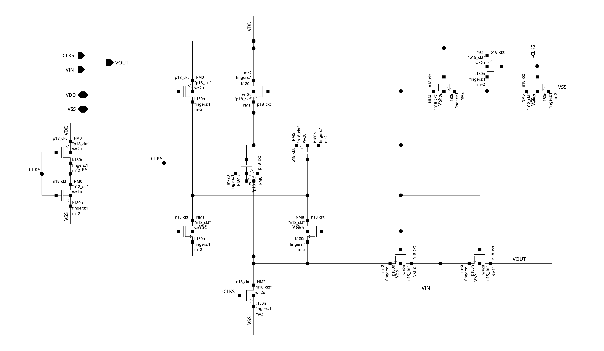

# A02a：BOOSTRAP 的采样管、MOS 电容与浮置节点

本课只验收一个问题：如何由实际连接解释 NM11 的 gate 在 track 阶段随输入运动？先预测 Vgs、Vgate 对地与 Vin/Vout 的关系，再对照器件连接和两相状态。原图来自本轮只读 OA 导出；以下端点电压是静态机制推导，尚未用 transient 验证。

library/cell/view 为 `8_bit_sar_adc/BOOSTRAP/schematic`；14 个实例全部是 SMIC n18_ckt/p18_ckt MOS。完整 terminal、保存尺寸与 source hash 见 [结构化证据](../../../notes/evidence/2026-10-04-adc-schematics.json)。图上 net 标签部分没有显示，以下名称来自 OA 读取，不按屏幕位置猜连接。

## 先划分四个功能

| 部分 | 实际连接 | 对应作用 |
| --- | --- | --- |
| 主采样管 NM11 | D=VOUT、S=VIN、G=net52、B=VSS | 信号导通；bulk 固定导致 body effect 仍可能随输入变化 |
| 储能器件 PM6 | G=net57；D/S/B=net56 | MOS 电容接法；保存 w=2 µm、l=180 nm、m=20，不能由几何直接给出固定 fF |
| 预充电与 gate 复位 | PM1 在 VDD/net57 之间；NM2 把 net56 接 VSS；NM4/NM5 串接 net52→net54→VSS | 保持阶段为下次 track 准备初态 |
| track 与隔离 | PM5 在 net57/net52 间；NM10 在 VIN/net56 间；NM1/NM8 联系 net44/net56 | 把电容下端随输入抬升，并让采样 gate 接上被抬升的上端 |

PM3/NM0 产生 −CLKS；PM2/NM5 由 −CLKS 驱动 net54；PM0 由 CLKS 控制 net44。PM1、PM5 的 bulk 接 net57，PM6 的 bulk 接 net56。这些 body 接法也是结构的一部分，分析器件端间电压时必须保留。

NM11 保存 w=2 µm、l=180 nm、m=2、fingers=1。它们是保存参数；实际 netlist 的 multiplier/CDF 展开、Ron 和结电容需要模型验证，不能由图上尺寸直接宣布采样性能。

## 低相位：准备电荷与关断采样管

按 rail-to-rail 的 CLKS 低相位端点推导，−CLKS 高：NM2 把 net56 拉向 VSS，NM5 把 net54 拉低，NM4 提供 net52 的放电路径；PM0 把 net44 拉向 VDD。net52 低使 NM11 关断，PM1 将 net57 充向 VDD，PM5 由高 net44 关断。

于是 PM6 的 gate 相对其 D/S/B 存储一份电荷：net57 高、net56 低。它是电压相关 MOS 电容，准确的 Q(V) 还取决于工艺模型和偏置；不能把保持时的所有电荷变化都当作固定 C×V。

## 高相位：先开启，再抬升并隔离

CLKS 高、−CLKS 低时，NM2/NM5 释放；PM2 将 net54 拉高，NM4 的导通条件随之改变。NM1 开启 net44/net56 的联系，PM0 释放 net44。启动瞬间的电压与 gate feedthrough 决定 PM5、NM10 怎样逐步开启，因此不能把一张端点表当作瞬态事件顺序。

当 NM10 使 net56 跟随 VIN、PM5 使 net52 接到 net57 时，PM6 储存的电荷让 net57 随下端上升；理想化基线为 `net57≈VIN+Vboot`，`net52≈net57`，故 NM11 的 `Vgs≈Vboot`。NM8 的 gate 接被抬升的 net52，可帮助保持 net44/net56 的联系。PM1 与 NM4 等支路需要在这一阶段隔离被抬升节点与固定电源。

这就是需要从实际结构理解的自举机制：gate 对地随输入变化，目标是 gate 相对输入端的驱动较稳定。这里 NM11 的 bulk 仍接 VSS，阈值可以随输入改变；有限储能、寄生分压、器件 Q(V)、预充电不足和漏电也会使 Vgs 与 Ron 偏离理想值。不能从 `Vgate≈Vin+VDD` 推出 Ron 完全恒定。

## 波形实验怎样验收这些判断

使用 `BOOSTRAP_test` 的独立工作副本，先明确模型和 clock duty，再用 DC 输入做短 transient。保存：CLKS、−CLKS、VIN、VOUT、net52、net54、net56、net57、net44；同时计算 NM11 的 Vgs/Vgd/Vgb/Vds，观察 PM1/PM5/NM4 的端间电压。

| 检验 | 推导基线 | 偏离时先检查 |
| --- | --- | --- |
| 低相位 net52 | 回低，NM11 关断 | 放电速度与残留 gate 电荷 |
| 低相位 net57−net56 | 获得预充电 | PM1 充电、相位长度和 PM6 Q(V) |
| 高相位 net56−VIN | 接近零 | NM10 建立与有限驱动 |
| 高相位 net52−VIN | 较 gate 对地电压稳定 | 寄生分压、gate 负载与泄漏 |
| 2 pF 上 VOUT | 在规定 track 窗内跟随输入 | Ron、源阻抗、aperture 和关断 pedestal |

通过标准由所选输入范围、误差预算、采样窗和 PDK 额定端间电压确定。当前未填实测值、未宣称任何可靠性或线性目标通过。下一项操作是先完成上述一组 DC 输入/两相波形，不同时展开系统 ENOB。

回到 [原图目录](../schematics.md) 或 [模块 TB 课](A02-module-testbenches.md)。
