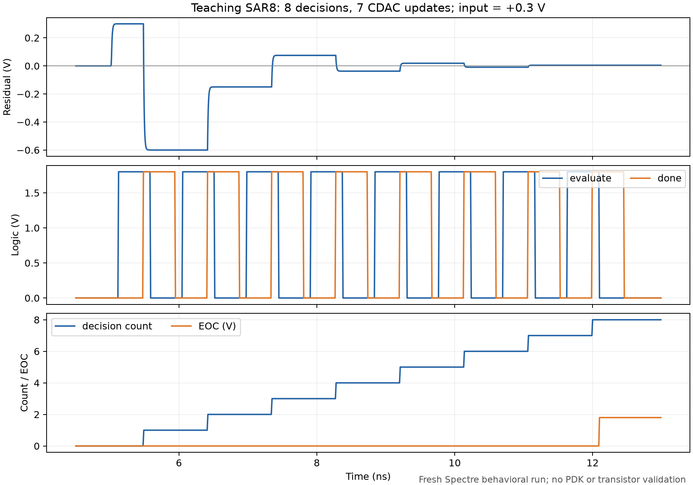

# A05：先建行为系统，再逐模块替换为真实电路

问题：怎样让 Verilog-A 系统模型成为电路学习的工具，而不是把关键机制藏起来？先预测：把所有模块理想化后，是否仍能验证异步时序和流水线样本对齐？本课建议先建立可观测的模块闭环，再以同一接口做替换。

本轮已通过 bridge 实时读两工程接口，并运行 [模块化 Verilog-A 教学基线](../../../models/adc_behavioral/README.md)。8 位行为系统有新仿真；12 位目前只有残差放大器教学模型与系统方案，完整流水线待建立。原始 DUT 与所有晶体管替换未运行。

## 1. 选语言和仿真域

采样/电容、比较器、reference 与残差放大适合 Verilog-A；SAR 状态机、编码、寄存器和数字对齐在工程上更适合 Verilog/SystemVerilog。为了先用 Spectre 建立不依赖 AMS 的基线，本轮也将握手状态机写成 electrical-port Verilog-A；这是便利选择，不能认为数字噪声/供电/延迟都已被模拟。

纯 electrical-port VA + MOS 可以由 Spectre 做模拟混合层级；接事件域 RTL 后，要另外检查 Xcelium/AMS license、connect rules、电压阈值和 timescale，不是把 .v 文件换进 Spectre 就能跑。控制算法、位序和 sample_id 的检查不应依赖最后理想 DAC 的模拟输出。

## 2. 两条模型轨道

功能模型用来证明八次决策、终止、位序、残差极性和码对齐；性能模型再逐项加入建立、有限增益、输出 headroom、offset、reference impedance 等。每次一项非理想，保留理想对照。新增的参数应来自模块 TB 拟合或明确的假设，不能凭一组系统 FFT 反推所有参数。

理想模型应有初态、reset、时钟边沿、输出负载与数据有效协议。比较器 evaluate 输出 one-hot、reset 输出 0/0 是当前教学合同，实际 compare 的极性/复位要核对后适配。把 Q 直接按 sign(vin) 连续生成会抹掉采样、判决时间和迟决风险。

## 3. 8 位异步 SAR：第一条替换链

本轮实时端口为 `SAR_ADC(VIP,VIN,VCLK,SEL,VREF1/2/3,VDD,VSS,DOUT<7:0>)`；SAR_LOGIC 输出 `P<1:8>/N<1:8>`，DAC_SW 使用 `P<2:8>/N<2:8>`。这与“八次比较、七组受控电容”一致，功能极性仍须波形核对。

| 步骤 | 保留的模型/换入的电路 | 先验收什么 |
| --- | --- | --- |
| B0 | 五个 VA 模块组成闭环 | 固定/交替输入，八次决策、七次位权更新、终止、输出位序与 overrun |
| B1 | 换真实 `compare(DACP,DACN,CLK,OUTP,OUTN,VDD,VSS)` | reset/one-hot 协议、VCM、负载、迟决；其余模型便于定位 |
| B2 | 换真实 EN_LOOP，再换 SAR_LOGIC/输出 DFF；每次一块 | VALID/CMP_OK/LATCH 的语义、阈值与终止，真实 P/N 状态 |
| B3 | 换真实 DAC_SW + 两侧电容阵列，并用与之相容的采样 switch | 保持真实 top-plate 电荷，long/short-window 位权与建立 |
| B4 | 两侧 BOOSTRAP 和输入 source impedance/采样负载一起闭合 | acquisition、held error、injection、端间电压；clock edge 不变 |
| B5 | 有限 reference source、供电和实际负载 | droop/恢复与采样/判决预算；最后才系统 FFT |

这是建议顺序而非固定法规。B1 若有明显 kickback，应提前恢复电荷域 CDAC/source impedance，否则刚性的 VA 残差源会把输入扰动压住。B3/B4 可以作为联合替换里程碑；真实 bootstrap 与 CDAC 共用 sampled node，不能在该节点上再挂一个保持电压的理想源，否则恢复了器件却删掉了物理机制。

实际替换不只是换 cell view。当前模型 phase/prefix 是调试合同，需要 adapter 映射真实 P/N、clock/reset 与 OUTP/OUTN。原 DOUT<0> 是 MSB；当前 bits[7] 是 MSB，必须反序适配，不能以 bus 名称认为位序相同。

## 4. 12 位 Pipelined-SAR：先闭合残差和编码

实际第一段 `DYSAR6b_200M` 有 din<5:0>、CAP_UP/CAP_DOWN、SAM−、CLK_DAC、参考和电源；第二段 `PiSAR_2st_8bit` 有 din<7:0>、CAP_UP/CAP_DN 等端口。`Pi-SAR_amp` 是含 sources 的顶层 TB，只暴露 OUTA；不能当成可替换的纯 DUT symbol。应在学习库另建 DUT 与 stimulus 边界。

定义第一级重构值 `xq1(c1)`，残差 `r1=x−xq1`，放大后 `y=G r1+eamp`，二级重构值 `yq2`，最终输入参考 `xhat=xq1+yq2/G0`。这里的极性、gain、range 和 sample latency 是合同项。报告给出的名义 G=8 尚须两相电荷与新 transfer curve 核对；本轮 gain=8 是教学参数。

数字分辨率取决于参考跨度与 gain：二级输入 LSB 为 `FS2/2^8`，输入参考为 `FS2/(2^8 G0)`。相对于整输入跨度 FS1，有效码间距比为 `FS1·2^8·G0/FS2`，不能仅凭“6+8−2=12”定系统位数或冗余。

| 步骤 | 工作内容 | 结果判断 |
| --- | --- | --- |
| P0 | 行为一级/二级量化、两相 residual、sample_id、合成；先独立审核编码 | 单调 transfer、同一个样本的 coarse/fine 组合，阶跃/交替序列 |
| P1 | 先保留行为模拟链，验证真实或等价数字 `D_adjust2` | c1 锁存、加法位权、条件校正、输出 latency |
| P2 | 一级或二级 SAR 各自换入，每次只一段 | 每段码范围/符号、残差输出、clock/加载 |
| P3 | 换 `amp_gainboost`，保留两个行为 SAR 的边界 | 极性、long-window gain、short-window settling、共模与 headroom |
| P4 | 真实两级 SAR + 残差放大 + 数字链 | 冗余纠错范围、pipeline alignment、残差过载与恢复 |

本轮 bridge 读取发现 D_adjust2 先用六只 Dflip-flop 在 c1 锁存一级码；再含两段 1b_adder carry chain、由 D2<5>/D2<7> 生成的控制与 SW2-1 支路。因而不能用随意的 `coarse<<6 + fine` 声称等价。下一次读 SW2-1 和 adder 的真值，再恢复实际偏置/校正公式及 bitstream latency。

## 5. 替换前后怎么比较

固定 stimulus、reference、初态、采样相位、输出负载、测量窗和解码法；每个结果带 sample_id。先 compare 协议，再 compare 数值。比较器完成、转换算法结束、外部码有效是不同事件。

放大器比例误差项约为 `(G/G0−1)r1`，二级量化误差约除以 G0；二级 headroom 之外的残差不可能靠数字冗余恢复。用残差接近零/接近极限的成对输入，区分比例误差与固定 offset。长窗改善提示动态建立，长窗仍偏差查 ratio/有限 DC gain/编码。

模块 TB 校准后，行为模型与电路采用同条件替换对照。记录模式/模型版本、绑定到哪个 cell/view、source/netlist hash、结果身份。最后完成一次有意的失败注入，例如错一周期对齐或比较超时，证明验收能发现错误。

## 6. 本次新运行证据与下一项

五样本输出 bus 独立解码正确，八个 evaluate 边沿/样本；约 7.080 ns 转换窗只是当前 tdec/tdet/tlogic 的结果。slow case 的过期 sample 覆盖使正在转换的 held input 改变，EOC 不再保证正确码。四次行为 transient 均 0 errors/0 warnings；[运行摘要](../../../notes/evidence/2026-10-04-adc-behavioral-baseline.json)、[波形验收](../../../notes/evidence/2026-10-04-adc-behavioral-waveforms.json)。

建议先验收 B0 的 sample→compare→done→reset→下一 bit→EOC 协议，然后给真实 compare 定义 reset/极性/负载 adapter 并核对 SMIC model/CDF。12 位先做 P0/P1 的编码和样本对齐，暂不替换 gain booster 内部晶体管。基础 PLL 与其他逆向课程的进度保留。
