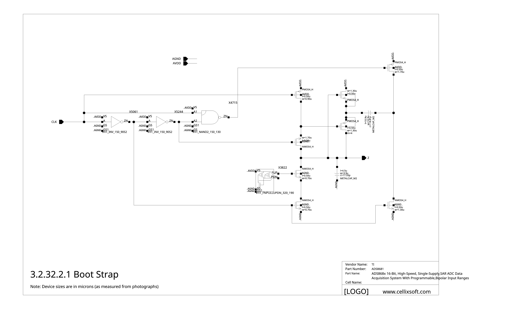
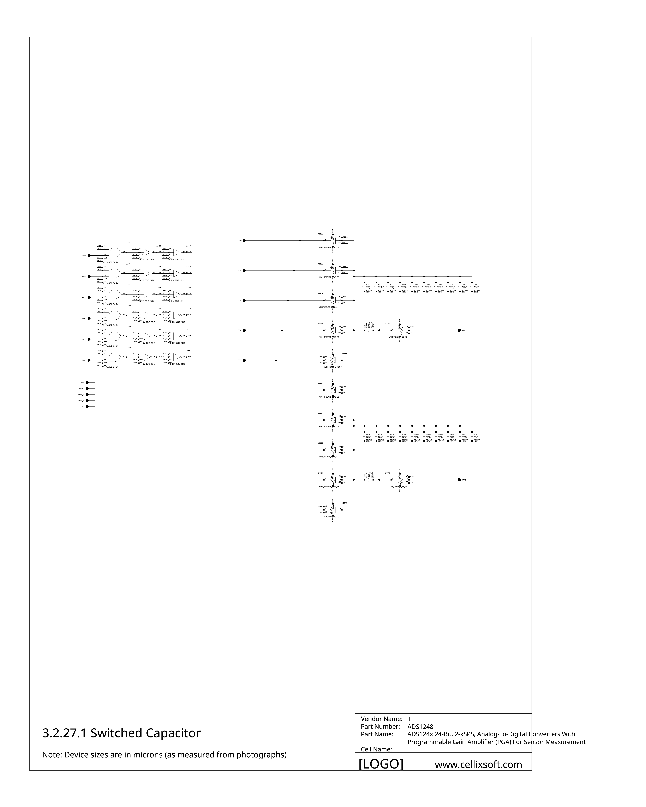

# ADS8681 / ADS1248：37 张实际电路图

这些 PNG 是 2026-10-04 独立 Virtuoso 会话从原始 schematic 原生导出，保留原始器件与连接。没有重画连接，没有新仿真。点击 cell 查看全分辨率；在远程桌面的独立 precision_adc_course 会话中也可打开对应 library/cell/schematic 放大。

部分来源页留白较多，部分器件标签重叠或仅在原生窗口放大后可读；用 [端子/保存参数/hash 清单](../../../notes/evidence/2026-10-04-precision-adc-schematics.json) 交叉查证，图像不替代端子表。source sch.oa 导出前后 SHA-256 相同，37 张下载图哈希已核对。

配套 [12 课目录](README.md) 与 [无 TB 方法](no-testbench.md)。功能说明中“候选/待查”不是已验证工作模式。

## ADS8681

| library/cell/schematic | 实例数 | 读图重点 |
| --- | ---: | --- |
| [HIX_2012210_TOP/TOP_HIER](../../../notes/evidence/precision-adc/schematics/HIX_2012210_TOP__TOP_HIER.png) | 63 | 顶层路径与未闭合的控制接口 |
| [HIX_2012210_SUB/PGA](../../../notes/evidence/precision-adc/schematics/HIX_2012210_SUB__PGA.png) | 13 | 反馈、增益选择与两侧负载 |
| [HIX_2012210_SUB/AMP](../../../notes/evidence/precision-adc/schematics/HIX_2012210_SUB__AMP.png) | 105 | 晶体管输入、bias 与内部反馈；先核对全部端口 |
| [HIX_2012210_SUB/AMP_3](../../../notes/evidence/precision-adc/schematics/HIX_2012210_SUB__AMP_3.png) | 157 | REFIO/REFCAP 路径与复杂输出支路 |
| [HIX_2012210_SUB/BANDGAP](../../../notes/evidence/precision-adc/schematics/HIX_2012210_SUB__BANDGAP.png) | 77 | BJT、电阻、startup 与 trim 候选 |
| [HIX_2012210_SUB/SWITCH_CAP_2](../../../notes/evidence/precision-adc/schematics/HIX_2012210_SUB__SWITCH_CAP_2.png) | 43 | 输入采样/电容组与各类 switch 分工 |
| [HIX_2012210_SUB/SAR_ADC](../../../notes/evidence/precision-adc/schematics/HIX_2012210_SUB__SAR_ADC.png) | 115 | 84 个 METALCAP_M2、COMP_1 与 Q<5:0> 接口 |
| [HIX_2012210_SUB/SAR_ADC_1](../../../notes/evidence/precision-adc/schematics/HIX_2012210_SUB__SAR_ADC_1.png) | 155 | 74 个 METALCAP_M2、COMP_1S1 与多组输入 |
| [HIX_2012210_SUB/COMP_BLOCK](../../../notes/evidence/precision-adc/schematics/HIX_2012210_SUB__COMP_BLOCK.png) | 14 | 三级 AMP_STAGE、五个比较子块、bias 与 control |
| [HIX_2012210_SUB/COMP_1](../../../notes/evidence/precision-adc/schematics/HIX_2012210_SUB__COMP_1.png) | 54 | 电容耦合、判决与 SAR 控制接口 |
| [HIX_2012210_SUB/BOOTSTRAP](../../../notes/evidence/precision-adc/schematics/HIX_2012210_SUB__BOOTSTRAP.png) | 15 | CLK→Z 升压驱动；无模拟 VIN 端口 |
| [HIX_2012210_SUB/BOOTSTRAP_1](../../../notes/evidence/precision-adc/schematics/HIX_2012210_SUB__BOOTSTRAP_1.png) | 15 | AMP_STAGE1 内的不同升压/驱动结构，body 与 VO 单独核对 |
| [HIX_2012210_SUB/SWITCH_15B](../../../notes/evidence/precision-adc/schematics/HIX_2012210_SUB__SWITCH_15B.png) | 33 | VI 与十五个 VO 的 transmission-gate 支路；不是位数证明 |
| [HIX_2012210_SUB/SAR_REG](../../../notes/evidence/precision-adc/schematics/HIX_2012210_SUB__SAR_REG.png) | 58 | 寄存器与时钟链；不代表完整码合成 |
| [HIX_2012210_SUB/AMP_1](../../../notes/evidence/precision-adc/schematics/HIX_2012210_SUB__AMP_1.png) | 67 | 前端输入与 reference/反馈支路 |
| [HIX_2012210_SUB/AMP_2](../../../notes/evidence/precision-adc/schematics/HIX_2012210_SUB__AMP_2.png) | 170 | 输出驱动、补偿与 bias |
| [HIX_2012210_SUB/AMP_STAGE1](../../../notes/evidence/precision-adc/schematics/HIX_2012210_SUB__AMP_STAGE1.png) | 43 | 比较器前置级与 BOOTSTRAP_1 |
| [HIX_2012210_SUB/AMP_STAGE3](../../../notes/evidence/precision-adc/schematics/HIX_2012210_SUB__AMP_STAGE3.png) | 49 | reference/额外输入、VOL_MUX 与输出级 |
| [HIX_2012210_SUB/COMP_2S2](../../../notes/evidence/precision-adc/schematics/HIX_2012210_SUB__COMP_2S2.png) | 32 | Q/QN 与 QS/QNS 四只 latch，观察相位要区分 |
| [HIX_2012210_SUB/SWITCH_CAP_1](../../../notes/evidence/precision-adc/schematics/HIX_2012210_SUB__SWITCH_CAP_1.png) | 111 | 多组输入/reference 汇到接收节点，按相追端点 |

## ADS1248

| library/cell/schematic | 实例数 | 读图重点 |
| --- | ---: | --- |
| [HIX_2012180TOP/TOP_HIER](../../../notes/evidence/precision-adc/schematics/HIX_2012180TOP__TOP_HIER.png) | 74 | 顶层路径与未闭合的控制接口 |
| [HIX_2012180SUB/INPUT_MUX](../../../notes/evidence/precision-adc/schematics/HIX_2012180SUB__INPUT_MUX.png) | 36 | 输入/参考选择、decoder 与 SWITCH_RES |
| [HIX_2012180SUB/PGA](../../../notes/evidence/precision-adc/schematics/HIX_2012180SUB__PGA.png) | 54 | 反馈、增益选择与两侧负载 |
| [HIX_2012180SUB/AMP](../../../notes/evidence/precision-adc/schematics/HIX_2012180SUB__AMP.png) | 66 | 晶体管输入、bias 与内部反馈；先核对全部端口 |
| [HIX_2012180SUB/AMP_6X2](../../../notes/evidence/precision-adc/schematics/HIX_2012180SUB__AMP_6X2.png) | 4 | 两侧 buffer 包装，回到 leaf cell 查 feedback |
| [HIX_2012180SUB/AMP_8](../../../notes/evidence/precision-adc/schematics/HIX_2012180SUB__AMP_8.png) | 82 | SC 前级、两组差分输出与 reference |
| [HIX_2012180SUB/AMP_9](../../../notes/evidence/precision-adc/schematics/HIX_2012180SUB__AMP_9.png) | 49 | 分相输入/反馈电容、晶体管及 reference 注入 |
| [HIX_2012180SUB/AMP_9S1](../../../notes/evidence/precision-adc/schematics/HIX_2012180SUB__AMP_9S1.png) | 47 | 后续级与第三对 COMP 输入；状态更新待查 |
| [HIX_2012180SUB/COMP](../../../notes/evidence/precision-adc/schematics/HIX_2012180SUB__COMP.png) | 47 | 三对输入、电容量化求和候选与 latch |
| [HIX_2012180SUB/COMP_1](../../../notes/evidence/precision-adc/schematics/HIX_2012180SUB__COMP_1.png) | 16 | 电容耦合、判决与 SAR 控制接口 |
| [HIX_2012180SUB/SWITCH_CAP_X4](../../../notes/evidence/precision-adc/schematics/HIX_2012180SUB__SWITCH_CAP_X4.png) | 6 | 四份信号端并联，enable 分组不同 |
| [HIX_2012180SUB/SWITCH_CAP_1](../../../notes/evidence/precision-adc/schematics/HIX_2012180SUB__SWITCH_CAP_1.png) | 52 | 多组输入/reference 汇到接收节点，按相追端点 |
| [HIX_2012180SUB/CLK_CTRL](../../../notes/evidence/precision-adc/schematics/HIX_2012180SUB__CLK_CTRL.png) | 85 | Q 反馈、多相输出与外部 control 缺口 |
| [HIX_2012180SUB/BANDGAP](../../../notes/evidence/precision-adc/schematics/HIX_2012180SUB__BANDGAP.png) | 57 | BJT、电阻、startup 与 trim 候选 |
| [HIX_2012180SUB/AMP_7](../../../notes/evidence/precision-adc/schematics/HIX_2012180SUB__AMP_7.png) | 57 | P929_G→P870_D 的参考驱动路径 |
| [HIX_2012180SUB/VREF_MUX](../../../notes/evidence/precision-adc/schematics/HIX_2012180SUB__VREF_MUX.png) | 13 | REFP/REFN 选择与 VREFCOM/VREFOUT |
| [HIX_2012180SUB/SWITCH_CAP](../../../notes/evidence/precision-adc/schematics/HIX_2012180SUB__SWITCH_CAP.png) | 53 | 一份对称 POLYCAP/开关网络，先做一次电荷转移 |

## 两个适合开始的结构问题

ADS8681 的 BOOTSTRAP 无 VIN，父级 [COMP_2/COMP_2S1 的实际实例端子](../../../notes/evidence/2026-10-04-precision-adc-bootstrap-parents.json) 将 Z 接比较器内网。先分预充与抬升，再判断它驱动哪个支路。ADS1248 的 SWITCH_CAP_X4 中四份子块共享 VI/VO/SW，先解释为什么是信号端并联，再研究 enable 选择。

