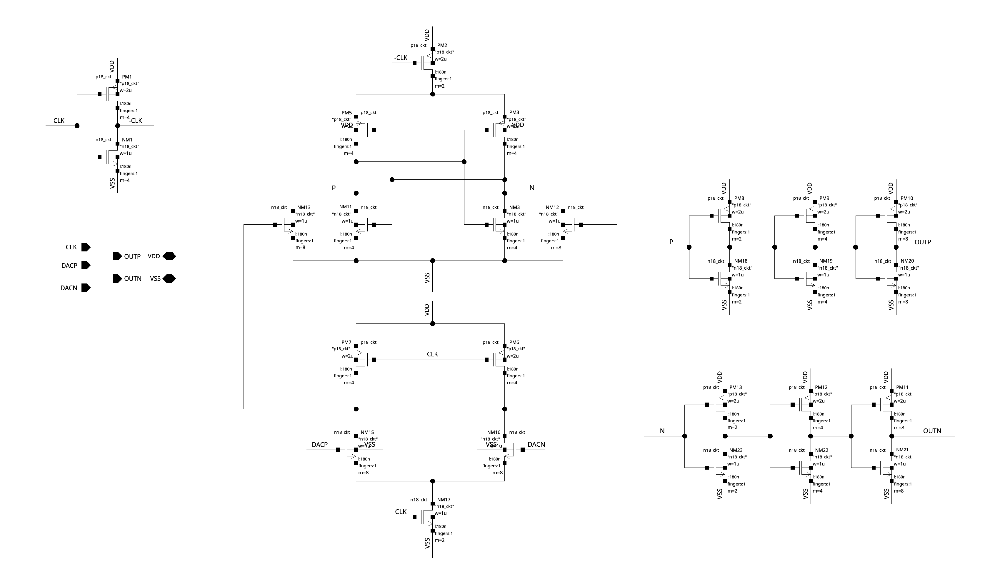

# ADC 实战：关键电路原图与读图入口

ADS8681 / ADS1248 的原图另见 [37 张精密 ADC 逆向电路图](precision/schematics.md)，配套 [12 课](precision/README.md)。以下 14 张属于异步 SAR 与 Pipe_SAR，不能混作这两个商业 ADC 的电路证据。

以下 14 张 PNG 由 2026-10-04 独立 Virtuoso 会话从实际 `schematic` 原生导出。全图保留来源器件与连接，没有重画或补造器件。已经实时只读核对库路径、连接和保存参数；**没有新网表或仿真，工作点、时序和性能仍待验证。**

点击 PNG 可查看大图。部分来源图的参数标签重叠，网名/尺寸请对照 [结构化记录](../../notes/evidence/2026-10-04-adc-schematics.json)。原图清单记录 source/image SHA-256 与像素尺寸，源文件导出前后哈希一致。远程桌面已有独立 `adc_project_course` 会话，当前打开 `8_bit_sar_adc/BOOSTRAP/schematic`；与已有 ADC/AFE 会话分别使用。

## 异步 SAR 的九张图

此表 library 为 `8_bit_sar_adc`，view 均为 `schematic`。

| 电路 | 原图 | 看什么 |
| --- | --- | --- |
| 自举采样开关 | [BOOSTRAP](../../notes/evidence/adc-projects/schematics/8_bit_sar_adc__BOOSTRAP.png) | NM11 采样管；PM6 MOS 电容；预充电、浮置与 gate 放电路径 |
| 自举独立 TB | [BOOSTRAP_test](../../notes/evidence/adc-projects/schematics/8_bit_sar_adc__BOOSTRAP_test.png) | 双路输入、clock 和每侧 2 pF；器件与性能测量的对应 |
| 动态比较器 | [compare](../../notes/evidence/adc-projects/schematics/8_bit_sar_adc__compare.png) | NM15/NM16 输入对、NM17 尾管、P/N 再生支路、三级输出 buffer |
| CDAC 单位开关 | [DAC_C_SW_1](../../notes/evidence/adc-projects/schematics/8_bit_sar_adc__DAC_C_SW_1.png) | VREF/Vcm/VSS 三路选择；PIN/NIN 的组合与切换瞬间 |
| CDAC 开关组 | [DAC_SW](../../notes/evidence/adc-projects/schematics/8_bit_sar_adc__DAC_SW.png) | 八个输出、七组控制；一个固定中间参考支路 |
| 异步反馈环 | [EN_LOOP](../../notes/evidence/adc-projects/schematics/8_bit_sar_adc__EN_LOOP.png) | OUTP/OUTN→VALID、CMP_OK、LATCH 的逻辑与延迟路径 |
| 位推进单元 | [SAR_LOGIC_UNIT](../../notes/evidence/adc-projects/schematics/8_bit_sar_adc__SAR_LOGIC_UNIT.png) | 判决锁存、P/N 输出与 Q 链；有效边沿仍需波形 |
| 完整 SAR 逻辑 | [SAR_LOGIC](../../notes/evidence/adc-projects/schematics/8_bit_sar_adc__SAR_LOGIC.png) | 八个 SAR_LOGIC_UNIT、第一/最后判决路径、终止与 reset |
| ADC core 与 CDAC 阵列 | [SAR_ADC](../../notes/evidence/adc-projects/schematics/8_bit_sar_adc__SAR_ADC.png) | I32/I33 采样，I34/I35 CDAC 控制，I36 比较器，I37/I38 握手及输出 DFF |

## Pipelined-SAR 的五张图

此表 library 为 `Pipe_SAR`，view 均为 `schematic`。当前也已实时只读核对，分析方法见 [A03](lessons/A03-pipelined-sar.md)。

| 电路 | 原图 | 看什么 |
| --- | --- | --- |
| 两级系统与残差网络 | [Pi-SAR_amp](../../notes/evidence/adc-projects/schematics/Pipe_SAR__Pi-SAR_amp.png) | 六位一级、八位二级、SC 级间传递、D_adjust2 合成与输出 observer |
| 级间增益增强放大器 | [amp_gainboost](../../notes/evidence/adc-projects/schematics/Pipe_SAR__amp_gainboost.png) | 主放大支路、两相 SC 网络、Bias、ampGA/ampGB 及共模路径 |
| 辅助放大器 A | [ampGA](../../notes/evidence/adc-projects/schematics/Pipe_SAR__ampGA.png) | 输入、折叠/负载和输出驱动；逐 terminal 追踪其增强对象 |
| 辅助放大器 B | [ampGB](../../notes/evidence/adc-projects/schematics/Pipe_SAR__ampGB.png) | 与 A 的互补连接、bias 和辅助环路动态 |
| 一级比较器 | [comparator4in2](../../notes/evidence/adc-projects/schematics/Pipe_SAR__comparator4in2.png) | VPN/VNN、Vrp/Vrn 四个输入怎样组成有效差分及再生路径 |

## 第一项结构学习：BOOSTRAP

已提出预测：track 阶段希望保持近似恒定的是采样管 Vgs、gate 对地电压，还是输出与输入之差？学员独立答案与理解尚未验收。

从图右下角 NM11 开始：D=VOUT，S=VIN，G=net52，B=VSS。沿 gate 回到 PM5，再回到 PM6 的 gate=net57；PM6 的 D/S/B 都接 net56。这是把 MOS 接作电容的实际结构，不应直接把它标成固定值 MIM Cboot。随后追预充电和释放路径，见 [A02a 逐器件读图](lessons/A02a-bootstrap-structure.md)。

## 同时看比较器结构，避免跨工程套用

当前 `compare` 共有 26 个 MOS 实例。NM15/NM16 的 gate 分别接 DACP/DACN，source 共接 net64，NM17 将 net64 接向 VSS，gate 接 CLK。PM7/PM6 的 gate 接 CLK，分别给 net90/net67 预充电。NM13/NM12 把这两节点的变化传给 P/N；PM5/PM3 与 NM11/NM3 构成交叉耦合，PM2 受 −CLK 控制向上侧供电。

P/N 经三次反相送到 OUTP/OUTN；这张图没有此前 `saradcII/comparator` 外层的 NAND SR latch。静态相位推导为 CLK 低时输入节点预充电、P/N 被拉低，最终两输出倾向高；CLK 高进入输入放电和再生。精确翻转时刻、残留电荷和 polarity 仍需小正/负差分 transient 验收。不能沿用另一工程“最终输出一直保持旧结果”的解释。

## 将原图接到课程

[A01 架构与电荷](lessons/A01-async-sar-architecture.md) 解释 core 与 CDAC；[A02](lessons/A02-module-testbenches.md) 给对应 TB 的激励、观察量和结果分析；[A03](lessons/A03-pipelined-sar.md) 解释级间残差与误差传播。AFE 的实际图另见 [AFE 原图入口](../04-afe4404/schematics.md)。基础 PLL 的具体模块原图仍待核对实际工程层级，不能以概念拓扑替代。
