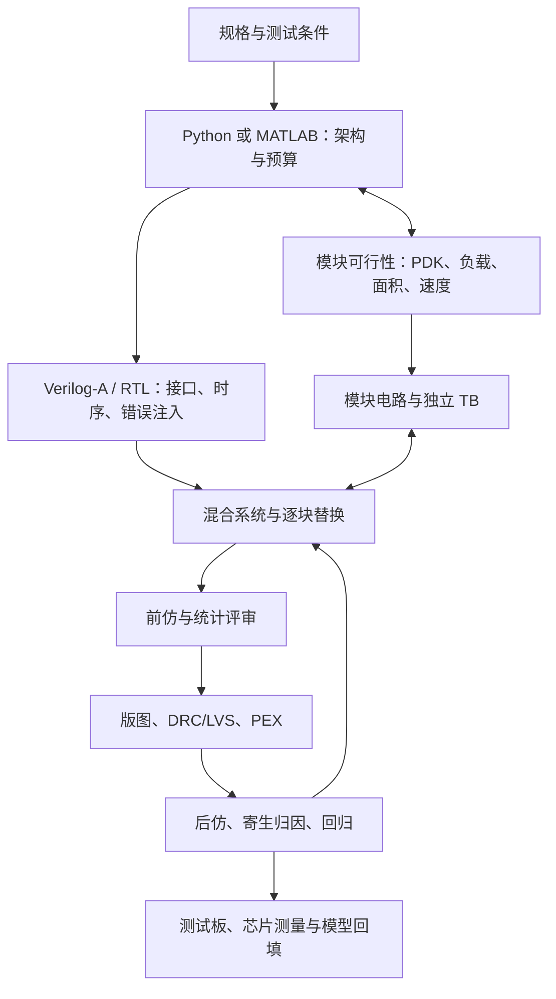

# SAR ADC 完整开发设计教程

本教程回答“一个 SAR ADC 从规格到电路、版图、实测怎样开发”，面向熟练模拟 IC 工程师。主线为单核差分 SAR，包含完整课文、可运行 Python 预算/算法示例、Verilog-A 接口、逐电路替换、模块 TB、前后仿与芯片测量；Pipelined-SAR 在最后扩展。目标是掌握各阶段的设计判断，不是依次使用所有工具。

常用路线确实是 **规格→MATLAB/Python→Verilog-A/RTL→模块电路与混合系统→版图/PEX→实测**。但 MATLAB 与 Python 通常二选一；Verilog-A 不是算法模型的逐行翻译。系统建模与采样/CDAC/比较器可行性应并行进行，电路/寄生/实测得到的参数再回填系统模型。



## 完整课文

| 阶段 | 课文 | 交付与验收 |
| --- | --- | --- |
| 需求 | [01 规格与测量合同](lessons/01-specification.md) | 位数/ENOB、输入/参考/源阻抗、速度、功耗、PVT、数据有效协议 |
| 架构 | [02 架构与转换机制](lessons/02-architecture.md) | bit search、电荷与时序图、binary/split、同步/异步选择 |
| 预算 | [03 噪声、失配与时间预算](lessons/03-budget.md) | 从系统指标到 C、Ron、判决、reference 的约束与余量 |
| 算法 | [04 Python/MATLAB 模型](lessons/04-algorithm-model.md) | 黄金量化、实际权重、静态线性、FFT 与非理想对照 |
| 混合接口 | [05 Verilog-A/RTL](lessons/05-veriloga-rtl.md) | 模块合同、reset/valid、sample_id、视图绑定和错误注入 |
| 模块 | [06 采样与自举设计](lessons/06-sampling.md) | acquisition、噪声、失真、注入、端间电压与模块 TB |
| 模块 | [07 CDAC 与开关设计](lessons/07-cdac.md) | 电荷矩阵、位权/失配、共模、能量和 reference 加载 |
| 模块 | [08 比较器设计](lessons/08-comparator.md) | 输入对/再生、延迟分布、offset/noise、kickback 与 reset |
| 控制 | [09 SAR 逻辑与时序](lessons/09-control.md) | 同步/异步事件、超时、死区、终止、码锁存与位序 |
| 支撑 | [10 reference、bias 与供电](lessons/10-reference.md) | reference droop/恢复、工作点/启动、耦合与驱动 budget |
| 整合 | [11 逐块替换与系统闭合](lessons/11-integration.md) | 同 stimulus/负载的替换对照、物理端口恢复与归因 |
| 前仿 | [12 静态、动态、PVT 与统计](lessons/12-verification.md) | DNL/INL、SNDR、码噪声、PVT/失配、回归与置信范围 |
| 物理 | [13 版图与实现约束](lessons/13-layout.md) | CDAC 匹配、时钟/参考/输入布线、井/供电、DRC/LVS |
| 后仿 | [14 PEX 与寄生闭合](lessons/14-postlayout.md) | 分块提取、寄生导致的位权/建立/耦合、前后仿对照 |
| 芯片 | [15 流片评审与实测](lessons/15-silicon.md) | 测试可观测性、bench floor、板卡/去嵌、数据可信度 |
| 扩展 | [16 Pipelined-SAR](lessons/16-pipelined-sar.md) | 残差范围/增益/冗余、样本对齐、gain boosting 的预算 |

每课包含问题、预测、机制/推导、具体实验、异常分析与验收要求。一次会话优先验收一个问题；“完整教程”指课文齐全，不意味着学员完成或芯片设计已验证。使用 [开发设计记录模板](../../notes/sar-development-template.md)。

## 三套案例，明确分开

1. **贯穿数值例子**：10 bit、20 MS/s、差分跨度 2 V、目标 ENOB≥9、300 K。VDD=1.2 V/VCM=0.6 V 是待验证的教学供电假设，功耗 2 mW 是示例目标；没有选定 PDK、器件尺寸或流片规格。不得套成现有工程保存值。
2. **实际 8 位异步 SAR**：`8_bit_sar_adc/SAR_ADC`，学习真实 BOOSTRAP、CDAC、compare、SAR_LOGIC/EN_LOOP。图与端口已读，原晶体管系统尚未新运行。见 [实际项目课](../05-adc-projects/README.md)。
3. **已有运行证据**：2026-10-04 GPDK comparator 的局部器件实验、8 位教学 VA 的四次行为 transient；它们来自不同模型与条件，不能互换。见 [器件比较器](../../notes/2026-10-04-comparator-delay.md)、[行为基线](../../models/adc_behavioral/README.md)。

## 可直接运行的教学计算

[sar_design_model.py](../../scripts/sar_design_model.py) 包含预算、带实际权重的逐位搜索、理想/单次失配的 transition DNL/INL、相干 FFT、采样噪声/比较噪声、jitter 与有限 DAC 建立。代码用 Python + NumPy/Matplotlib；MATLAB 可按相同方程实现，不要求再重复写一套。

```bash
python scripts/sar_design_model.py --output your_new_output_directory --seed 42
```

输出目录须不存在，防止覆盖运行身份。2026-10-05 的新离线计算见 [summary](../../notes/evidence/2026-10-05-sar-design-model/summary.json)、[电容/噪声图](../../notes/evidence/2026-10-05-sar-design-model/noise-capacitance.png)、[建立图](../../notes/evidence/2026-10-05-sar-design-model/acquisition-settling.png)。它们是数值教学模型，**本轮没有新增 EDA 仿真**。

运行环境需要 Python、NumPy 与 Matplotlib；本次使用仓库忽略目录中的既有环境，版本与运行身份见 [本轮记录](../../notes/2026-10-05-sar-development.md)。算法脚本无需连接 Virtuoso；05/11 的真实混合替换使用独立 EDA 工程与 bridge。各课基本公式给出假设/推导，具体原图、端口与已有运行就近链接到工程证据；本教程未核实新的外部论文或新的 PDK 参数。

## 建议学习顺序

先用 01–04 写自己的 spec/budget 并读一次逐位轨迹，再看 05 与已有 VA 基线；06–10 的模块可并行研究，但仿真每次只验收一个机制。11–12 完成混合系统的同条件比较，随后进入版图/PEX。16 在单核信号链闭合后学习。基础 PLL、AFE 与精密逆向分支的续学点保留。

首个验收问题：CDAC 总电容为什么不能仅由 kT/C 决定？用 03 的 23 fF 与 10.24 pF 两个不同假设解释 matching、建立和 reference 驱动如何反过来影响架构。
