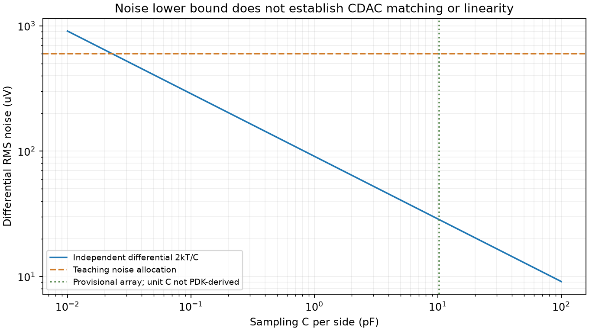
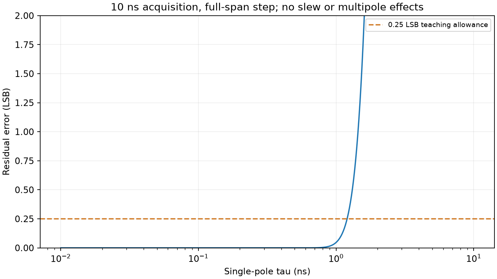

# 03：把系统指标分配为噪声、线性与时间预算

问题：CDAC 由 kT/C 算够就行吗？先预测噪声下限和满足 matching 的阵列谁更大，再看以下例子。所有数值是教学假设与新离线计算，不是 PDK 或现有 ADC 指标。

## 量化与随机误差

N=10、VFS=2 V 得 LSB=1.953125 mV；理想均匀量化误差的 RMS≈LSB/√12=0.56382 mV，这个统计近似对极小 DC、相关量化和异常码不必成立。满量程差分正弦 RMS=VFS/(2√2)=0.7071 V。按 ENOB=(SNDR−1.76)/6.02，ENOB=9 对应 55.94 dB，允许总误差功率所对应 RMS 约 1.12846 mV。

在不相关且统一输入参考的近似下，扣除量化功率，非量化 RMS 余量为 √(1.12846²−0.56382²)=0.97751 mV。暂分采样 0.6、比较器 0.4、reference 0.3、其他 0.2 mV；连量化 RSS=0.98381 mV，噪声项对应约 57.13 dB，留有有限余量。INL/失真、迟决和 missing code 不能全塞进 Gaussian RSS；它们需要独立线性/动态实验。

这些都是每个有效样本的输入参考 RMS，不是 nV/√Hz。实际 noise density 必须乘带宽/传递函数并处理采样折叠、相关性；reference 噪声也不是所有转换相都等比例传到输入。

## 采样电容下限与 matching

单个 RC 的单边电压 PSD 为 4kTR/[1+(2πfRC)²] V²/Hz，积分 f=0…∞ 得 kT/C。两侧相同 C、独立噪声时差分方差为 2kT/C。分配 0.6 mV、300 K 得 C≥23.01 fF/侧；实际耦合采样拓扑需按 covariance 重推，不能总套 2kT/C。

若**暂假设** unit Cu=10 fF，十位 binary 含 dummy 共 1024Cu，Ctotal≈10.24 pF/侧，理想差分采样噪声约 28.44 μV。Cu 是否能实现、relative mismatch/gradient/边缘寄生怎样，要读 PDK 与版图；“10 fF”不是已选尺寸。这显示 matching/实现可能远比热噪声约束强，不能为降低 kT/C 无限加 C。

## acquisition 与 bit settling 分开

单极点、无 slew、初始误差 ΔV 的近似为 e(t)=ΔV·exp(−t/τ)，故 τ≤t/ln(ΔV/eallow)。取 eallow=0.25 LSB=0.48828 mV，保守 ΔV=2 V、acquisition=10 ns，τ≤1.20225 ns；若 C=10.24 pF，Rsource+Ron 等效上限约 117.4 Ω。

每位 DAC window 只有 2.2 ns，若该节点最坏步幅 1 V，同误差 allowance 得 τ≤约 0.2885 ns。这与采样的 1.202 ns 不相同。实际小位步幅更小，bridge/寄生/多极点、reference 环路和 kickback 都会改变条件。

## 时间、失配与能量

50 ns 周期暂分 acquisition 10 ns、十位各 3 ns、输出/guard 6 ns，剩 4 ns。每位 3 ns 暂按 DAC 2.2 ns、compare 0.3 ns、reset 0.3 ns、logic 0.2 ns **保守串行**相加；真实异步可重叠，需事件图证明，不凭公式宣布闭合。小 overdrive 的比较尾部和极端 PVT 要有 deadline/错误检测。

失配是固定某颗芯片的权重误差；先由 transition DNL/INL 回推允许权重，再由 PDK matching/版图决定面积。随机 unit averaging 只是一种初步模型，gradient、边缘/连线寄生与相关性不能假定被 1/√面积消除。

能量分 reference、输入 driver、比较器、逻辑、clock/bias；从供电电流积分 E=∫VI dt，注明回馈能量与平均 scope。2 mW、20 MS/s、ENOB=9 的 Walden FoM 示例约 195 fJ/conversion-step，只是目标归一化量，不是功耗预测。

验收：解释 23 fF 与 10.24 pF 为什么不是矛盾，区分 acquisition 与 bit settling，指出最需要 PDK 回填的两项。数值复现见 [脚本](../../../scripts/sar_design_model.py)。接 [04](04-algorithm-model.md)。
